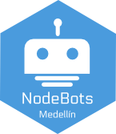

# NodeBots Day 7/27 - Medellín

El próximo 27 de Julio del 2013 se celebrará el [NodeBots Day](http://nodebotsday.com), un evento internacional donde estaremos realizando Hardware Hacking con Node.js.

En Medellín se realizará dentro de la 5ta edición del [BarCamp Med](http://www.barcampmedellin.org/) - tejido social digital!

## Organizan
El equipo de [MedellínJS](http://medellinjs.org)

* Julián Duque ([@julian_duque](http://twitter.com/julian_duque))
* Adrián Estrada ([@zenedsadr](http://twitter.com/zenedsadr))
* Álvaro Agámez ([@CodeMaxter](http://twitter.com/CodeMaxter))

## Agenda
Desde las 9am hasta las 5pm.

_contenido por definir_

## Lugar
[Parque Explora](https://www.google.com/maps?q=Parque+Explora&ll=6.271042,-75.563343&spn=0.018514,0.031972&sll=27.370354217574423,-82.51921790000002&sspn=0.07378589616566318,0.1606115116141169&t=m&dg=opt&hq=Parque+Explora&radius=15000&z=16&iwloc=A)

## Registro
[barcampmedellin.eventbrite.com](https://barcampmedellin.eventbrite.com/)

## Requisitos para participar
* Tener instalada la última version estable de Node.js (v0.10.x), la pueden descargar de [nodejs.org/download](http://nodejs.org/download/)
* Instalar el paquete `nodebotsdaymed13` desde npm, ejecutando `npm install nodebotsdaymed13`

## Bring Your Own Hardware!
Si tienes alguno de los siguientes dispositivos, tráelos para que sea mucho mas divertido!

* [Raspberry Pi](http://www.raspberrypi.org/)
* [Arduino Uno](http://arduino.cc/en/Main/arduinoBoardUno)
* [Parrot AR Drone 2.0](http://ardrone2.parrot.com/)

## Patrocinadores
¡Muchas gracias a nuestros patrocinadores!

* Daniel Aristizabal ([@cronopio2](http://twitter.com/cronopio2))
* Barcamp Medellín ([@barcamp_med](http://twitter.com/barcamp_med))

Si desea ayudar a que este evento tenga un mayor impacto para la ciudad puede donar un [SparkFun Inventor's Kit](https://www.sparkfun.com/products/11227) y lo puede pedir con 20% de descuento!
Más información sobre los descuentos [aquí](https://github.com/nodebots/nodebotsday/blob/master/Organizers.md#discounts)

## Agradecimientos
* [Equipo organizador](http://www.barcampmedellin.org/organizan/) de Barcamp Med 5
* [Daniel Shaw](http://twitter.com/dshaw), [Raquel Velez](http://twitter.com/rockbot), [Rick Waldron](http://twitter.com/rwaldron), [Juan Pablo Buriticá](http://twitter.com/buritica), [Emily Rose](http://twitter.com/nexxylove) y [Chris Williams](http://twitter.com/voodootikigod)

## Créditos
* [Robot](http://thenounproject.com/noun/robot/#icon-No6865) designed by [Julien Deveaux](http://thenounproject.com/Julihan) from The Noun Project
